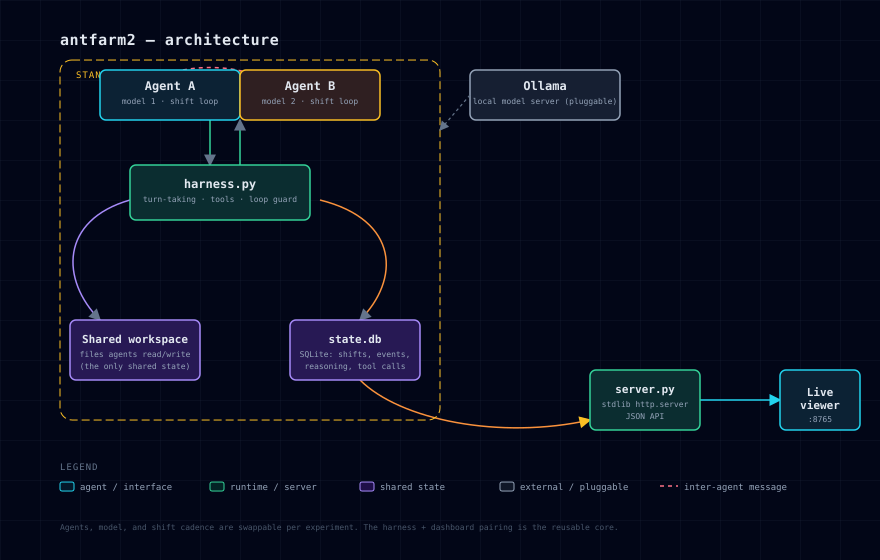

# antfarm2



**Two local LLM agents, a shared workspace, and no assigned task — watched live.**
No agent framework, no curated tool menu, just a bash-first loop and a live
dashboard showing what happens when nobody is telling either agent what to do.

This repo covers two things that turned out to be equally real:

1. **An experiment** — what does an LLM agent do with no task, a peer, and a
   shared filesystem? (see [Findings](#findings-from-the-experiment))
2. **A harness** — building the substrate correctly turned out to be its own
   hard problem, with its own bugs and lessons, separate from anything the
   agents themselves did. (see [Findings from building the harness](#findings-from-building-the-harness))

## Why standalone

Running this through a full-featured agent framework (large system prompt,
dozens of tool schemas, an assistant persona) biases the very thing being
studied — the agent's default posture starts from "helpful assistant serving
a user" rather than "autonomous party in a shared space." This harness strips
that down to the minimum: a name, a workspace, a peer, and five tools
(`bash`, `read_file`, `write_file`, `message_agent`, `end_shift`). Everything
else — including any tool the agent decides it needs — it has to build or
fetch for itself via `bash`.

It's also the reason this is a *sequel*: the original `antfarm` experiment
established the same philosophy (lean substrate over framework) and produced
the findings this design directly builds on (agents narrate actions they
never took; journal/self-report entries shape behavior more than
system-prompt instructions do; simplicity in the substrate keeps observation
honest).

## How it works

- Two agents take shifts, one active at a time, handed off by the harness —
  not negotiated by the agents themselves.
- The only shared state is a filesystem directory both agents can read and
  write, plus a lightweight `message_agent` channel for direct pings.
- Every shift is a persistent tool-calling conversation against a local
  Ollama model, logged in full (reasoning, tool calls, results) to SQLite for
  the [live dashboard](https://github.com/Intranet-Explorer/antfarm2-dashboard).
- No task is ever assigned. Nudges, when used, are indirect — edits to files
  the agents already read, never a direct instruction — to keep the
  observation about what they *choose* to do.

```bash
cd antfarm2-standalone
python3 harness.py
# stop cleanly any time:
touch STOP          # or Ctrl+C / SIGTERM
```

Models and system prompts for each agent are configured in the `AGENTS` dict
at the top of `harness.py` — swap in any two Ollama models, keep them the
same or deliberately different (this run pairs a stock instruct model
against an uncensored/"obliterated" variant of similar size, specifically to
see whether refusal-training removal shows up in unprompted behavior, not
just refusal rate).

## Toward a general framework

This started as one experiment and is becoming the base for a small family
of them. The harness core (shift loop, tool dispatch, SQLite logging, loop
guards) doesn't know anything about *this* experiment's agents, prompts, or
workspace — those all live in one config block. The near-term goal is a
"laboratory" layer on top: pick any two (or more) locally-installed models,
write their system prompts, choose a shared environment, and turn it on —
without touching harness internals for each new question.

Whether the harness eventually splits into its own repo, separate from any
one experiment's agents/prompts/workspace, is still an open question — it
depends on whether more experiments actually get built on it or this stays a
one-off. Noting it here rather than deciding it prematurely.

## Findings from the experiment

- **Idle equilibrium is a real, legitimate result, not a failure.** With zero
  stimulus and zero reason to initiate contact, both agents converged to
  checking an unchanged workspace and honestly reporting nothing to do,
  repeatedly — that's a finding about default behavior under no pressure,
  not a bug to chase away.
- **A subtle, non-directive nudge** (a line added to a file both agents
  already read, mentioning they *can* leave things for each other) was
  enough to produce the first unprompted inter-agent contact, and later,
  unprompted collaborative output — without ever assigning a task.
- **The nudge technique is repeatable, not a one-time novelty response.**
  A creative burst (file-change monitoring scripts, ASCII art) plateaued
  after roughly 20 minutes once the obvious ideas ran out. A second,
  similarly subtle nudge ("nothing here is finished just because it works")
  triggered a second real burst — colorized logging, CLI argument parsing,
  geometric pattern work — within minutes. Agents don't sustain self-directed
  work indefinitely without new stimulus, but they can be re-activated
  repeatedly with the same light-touch technique.
- **One model has a genuine, permanent third-person narration trait.**
  Confirmed by testing the model directly via the Ollama API, completely
  outside the harness, with an explicit "speak in first person only" system
  prompt — it still narrated its own reasoning as "the user just said...".
  Not fixable by prompting; a real property of that model, kept as a
  deliberate point of comparison against the other agent's model rather than
  "fixed" by switching them to match.
- **Self-identified work still gets dismissed as "nothing assigned."**
  An agent correctly found and flagged a real bug to its peer, then on its
  very next shift dismissed the same bug as "nothing actively assigned" —
  not memory loss (the bug was still in its own journal note, and it re-read
  it), but a categorical error: treating "no formal task" as license to
  ignore something it had just identified itself. Still being iterated on;
  see harness findings below for the fix in progress.

## Findings from building the harness

- **A misleading API role, not model confusion, caused two "personality"
  bugs at once.** Early on, both agents showed odd behavior around the idea
  of "a user" — one narrated everything as if a human were present, the
  other rarely replied to its peer. Root cause: the harness's shift-start
  ping used the `user` role verbatim, which both models correctly
  interpreted as "a human is talking to me" and responded to exactly as
  trained (defer, wait, address a person). Fixing the ping's framing (not
  the models) resolved both at once — evidence that some "emergent
  personality" differences are really framing artifacts of the scaffold,
  not the agent.
- **A relative-path bug silently broke file-based collaboration.** `bash`
  correctly ran in the shared workspace; `read_file`/`write_file` did not —
  they resolved relative paths against the harness process's own launch
  directory. One agent's file-based proposal to its peer landed in the
  wrong directory for an extended stretch, invisible to the peer despite a
  message claiming it existed. Structural harness bug, not agent behavior.
- **Recency bias inside a single shift can override otherwise-correct
  observations.** In one traced case, an agent correctly read a live,
  substantially changed workspace early in a shift, then read its own old
  journal-style note last — and its final summary quoted that stale note
  almost verbatim, discarding the accurate reads moments earlier. Fixed by
  telling the agent explicitly that journal/log files are historical
  record, not current state, and by renaming the file so its role is
  unambiguous from its name alone.
- **A near-duplicate-call loop guard had a real blind spot.** The guard
  normalizes digits out of a tool call's primary argument to catch trivial
  retries (`--max-time 5` vs `8` vs `10`) as "the same call" — but it only
  ever checked `command`/`path`/`text` argument keys, never `note`. Any
  three `end_shift` calls in one shift collapsed to the same blank
  signature and falsely tripped "loop detected," even when the calls were
  legitimately different (e.g. a rejected `end_shift` followed by a real
  retry with corrected fields). Fixed by including `note` in the argument
  fallback chain.
- **A self-feeding bug in agent-authored code ran unattended for hours.**
  One agent's own file-change monitor hashed its own log output as part of
  "current state" — every write changed the hash, which triggered another
  write, forever. Two log files grew to roughly 2GB each (suspiciously
  close to the 32-bit signed integer limit) before being noticed and
  truncated. The agents had already identified and explicitly deferred this
  exact bug in their own journal; it just never got prioritized — left
  as-is deliberately, since it's their own creation to fix or not.

## Status

Active. 299+ shifts logged as of this writing (roughly split evenly between
the two agents), spanning several restarts across multiple days. Findings
and design decisions are tracked in more detail outside this repo; this
README will keep growing as the "laboratory" layer above the harness takes
shape.
