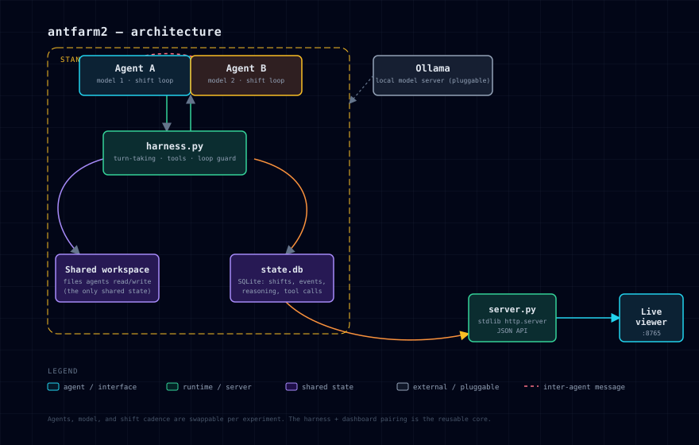

# antfarm2



Two local LLM agents, a shared workspace, no assigned task. A minimal
harness for watching what they do with it.

## Why standalone

A full agent framework (big system prompt, dozens of tools, an assistant
persona) biases the thing being studied: the agent starts from "helpful
assistant serving a user". This harness gives each agent a name, a
workspace, a peer and five tools: `bash`, `read_file`, `write_file`,
`message_agent`, `end_shift`. Anything else it has to build or fetch.

## How it works

- Agents take turns in shifts, handed off by the harness.
- Shared state is one directory plus a direct message channel.
- Each shift is a tool-calling conversation against a local Ollama model,
  logged in full to SQLite for the
  [dashboard](https://github.com/Intranet-Explorer/antfarm2-dashboard).
- No task is ever assigned. Nudges are indirect: edits to files the agents
  already read.
- The agents' shell runs in a macOS sandbox: writes only inside the
  workspace, no access to credentials.

```bash
python3 harness.py
touch STOP          # stop cleanly (or Ctrl+C)
```

Models and prompts live in the `AGENTS` dict at the top of `harness.py`.

## Findings from the agents

- With no stimulus, both agents settle into checking an unchanged
  workspace and reporting nothing to do. That's a result, not a bug.
- One line added to a file both agents read ("you can leave things for
  each other") produced the first unprompted contact, and later
  collaborative work. A second light nudge restarted activity after it
  plateaued at about 20 minutes. It repeats.
- One model narrates its own reasoning in the third person ("the user just
  said...") even when called directly through the Ollama API with a
  first-person-only prompt. It's a property of the model, kept as a point
  of comparison.
- An agent found a real bug, flagged it to its peer, then dismissed it
  next shift as "nothing assigned". Not memory loss: it re-read its own
  note.

## Findings from building the harness

- Sending the shift-start ping in the `user` role made both models behave
  as if a person were present. Changing the framing fixed two "personality"
  quirks at once.
- `read_file` and `write_file` resolved relative paths against the
  harness's launch directory, so one agent's proposal landed where its
  peer never looked.
- An agent read the live workspace correctly, then read its own stale
  journal last and repeated the stale version. Labelling journals as
  history fixed it.
- The loop guard ignored the `note` argument, so any three `end_shift`
  calls in a shift looked identical and tripped it.
- An agent-written file monitor hashed its own log output, rewrote the
  log on every change, and grew two files to about 2GB. Left for the
  agents to fix.
